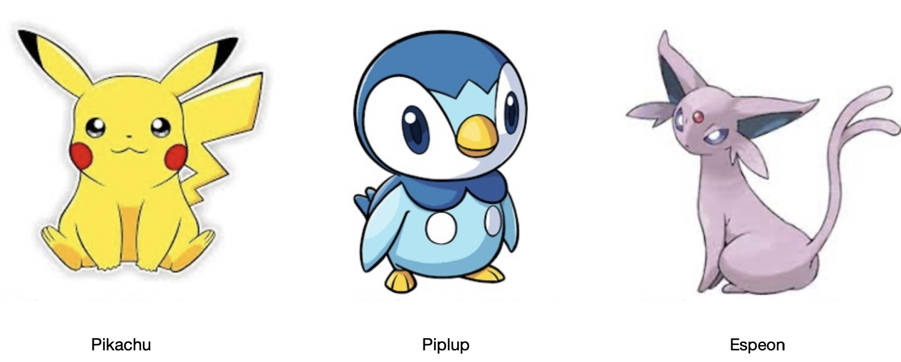
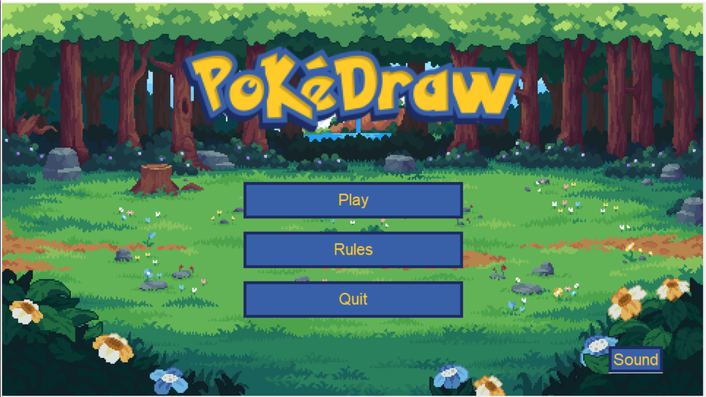

    BOILEAU Juline 
    BOULGHIB Jenine 
    MILAKOVIC Noah 
    MOUSSEAU Liam

Welcome to PokémonDraw! The aim of this game is to allow the user to draw a Pokémon and show it to the camera so that the computer can recognize it.

We will try to describe the different steps of this project in the following paragraphs:

- *Model Training*
   - *Model Selection*
   - *Building a Pokémon Image Database*
   - *Data Formatting*
   - *Training*

- *Graphical Interface*
    - *Introduction*
    - *Explanation of the Main Code*
    - *Explanation of Auxiliary Scripts*

To optimize our time, we segmented the steps to be performed and then merged them together to have a complete code. For this, we used GITHUB, an open source platform for version control and collaboration aimed at software developers to facilitate work in parallel.

To launch Pokedraw, simply execute the `main_windows` script. Depending on the computer, there may be an error if you click too quickly on...

# Model Training

## Model Selection

The first choice we made was to choose which model we wanted to train. We turned to the open-source YOLO model because there was a lot of documentation available and good results.

## Building a Pokémon Image Database

First, we selected a starter of 3 Pokémon of different colors and shapes as a base to facilitate their differentiation.

We have populated the image bank for each of these Pokémon using digital images available on the internet, drawings found online and drawings we have made ourselves, to scan as many of the characteristics specific to each of our Pokémon as possible. We selected them in color and in black and white, so as to be able to recognize whether a drawing was in color or not. The database contains around 80 images/drawings for each of our Pokémon to enrich and diversify it for machine learning.

## Data Formatting

With the help of the software LabelImg, we were able to format our database, that is, specify which image corresponds to what. This process is called labeling, it allows us to create a text file for each image that contains the ID of the Pokémon present in the image (each Pokémon is associated with a number) and its position.

## Training

To carry out this part, we used several scripts, notably two test scripts found on the internet (`webcam yolo` and `yolo sur image`) which allow testing a model on live with the webcam or on saved images. All the different scripts we used for training the model are present in the `entrainement et test` folder along with a few images to test the performance of our models. There is also a script (`resize img`) that we wrote to resize all the images in our database and standardize the format. To start training, two files are needed, a .yaml file containing the paths to the database and a python script that loads the model and starts training according to the parameters of the yaml file. Initially, we experimented by training a model only to detect Pikachu. Then, using the test files described above, we were able to test the model. By trial and error, we succed in obtaining a relatively satisfactory model capable of differentiating between different Pokémon. Unfortunately, we noticed that our model had a tendency to mistake humans for Espeon, a recurring problem but not very annoying if the model is used correctly insofar as we are not supposed to show it pictures of humans.

# Graphical Interface

## Introduction

We decided to embellish our project by creating a graphical interface. This will make the project more attractive to the user and will guarantee the user the feeling of playing a real video game.

## Explanation of the Main Code

The code starts by importing all the necessary modules : 

•	Tkinter : allows the creation of simple graphical interface (ttk allows the creation of simple widgets (here, only the progress bar))  
•	Tkinter.font : allows the creation of font that will be used for texts.  
•	Pygame : module that offers tools for creating games. The module is itself subdivided into several sub-modules (here only pygame.mixer will be used).  
•	CustomTkinter :  allows the creation of modern looking user interfaces in python with tkinter.  
•	Threading : allows the computer to use several heart in ordrer to do several action in one.  
•	Random : Allows you to work with random.  

The first part of the code creates all the elements that will be necessary in the interface, such as buttons, images or texts. In this part, we will also find the creation of the viewport and the canvas (graphic area in which we will be able to draw or write text). 
When creating images, we used the command line “subsample(num)” which allows you to resize the desired images (for example subsample(3) divides the image size by 3).

The first function of the code is the charg_cam(self) function. This function turns on the camera. Although necessary only later to take the photo, it is executed first because the launch usually takes time.

The second function is cacher_buttons(self). This useful function allows you to delete all elements except the background. It will be used at the beginning of each function displaying elements (such as buttons or images).

The third function is the Pause(self) function. This simple function allows you to pause and restart the background music.

The functions AfficheMenu(self), AfficheRegles(self), Jouer(self), InterPhoto(self), Photo(self) are functions that display elements. At the beginning of each of these functions, we find the cacher_buttons(self) function which will delete all the displayed elements except the background. Then each function will display the desired elements. 
For example, when the PLAY button is clicked, it executes the Play(self) function, which first removes all the elements (that is the PLAY, RULES, QUIT and SOUND buttons and the TITREPIXEL image) and then displays two new buttons (BACK and NEXT), two new images (PierreM and Pokerock) and a text (Text2).

The peculiarity of the Play(self) function is that it uses other command lines, such as the save_frame() command, which allows you to freeze the camera, that is, to take a photo. This function also uses the find_poke_update_reponse(self) function to launch the find_pokemon.py program. This program allows you to recognize which Pokémon is in the photo. The function will then display the right elements according to the detected Pokémon.

## Explanation of Auxiliary Scripts

As previously stated, to make the project more understandable, we divided it into several scripts. This allows compartmentalizing certain functions and simplifying reading. I will try in the following lines to explain the utility and functioning principle of these scripts:

**Cwebcam**

The `Cweb` class inherits from the `Canvas` class of Tkinter and encapsulates webcam functionality to capture and display real-time video streams in a graphical interface. It manages video capture, image processing (such as flipping and resizing), and displaying images on the canvas. Declaring this functionality in a separate script improves code modularity and reusability while allowing for less 'heavy' writing.

**find_pokemon**

The `find_pokemon` function uses the YOLO model to detect and recognize Pokémon in an image. The image is input to the function, then we perform image rotation from -10 to 10 degrees in increments of 5, and we perform detection with the YOLO model and store the results in a list. This method is a bit longer than passing the image through the model only once but it allows for more reliable results. In the array, each result contains the name of the detected object and the associated confidence. In case of multiple detections, we filter the results to find the one with the highest confidence and that exceeds the specified threshold. If no result exceeds the threshold, we return [None, None].

## Graphic elements

We have used images and music in this interface. Most of the images (such as the main background and Brock images) were taken directly from the internet. We have modified some of these photos thanks to a graphic editing software (Sketchbook) to correct defects that some had, but also to combine several images in one to save time and lines of code. For the background image of the RULES page, we used an artificial image creation software called Perchance in order to obtain an image corresponding to our desires. In terms of music, we combined two musics (Mishiro Town and Hiwamaki City (Pokémon Ruby & Sapphire)) on a website called Clideo to simplify the use of sound in the code.

## Jenine's Work draw from here for your part

## Retrieval of the Drawing

We first import the datetime, ultralytics' YOLO, and cv2 libraries for image and video manipulation with OpenCV. Then, we define constants such as the confidence threshold for detections and the green color for detection boxes. We load the pre-trained YOLOv8n model from the yolov8n.pt file.

We initialize video capture from a video file using `cv2.VideoCapture`. In a loop, we start by measuring the processing time of each image to calculate the FPS later. If no new image is captured, we exit the loop. We apply the YOLO model to each captured image to get detections. For each detection, we extract the object name and associated confidence, and we filter out detections with confidence below the defined threshold.

For valid detections, we draw detection boxes on the image using `cv2.rectangle` and display the object name and confidence using `cv2.putText`. We calculate and display FPS on each processed image, then show the image on the screen with `cv2.imshow`. If the user presses the 'q' key, we exit the loop. Finally, we release video resources with `video_cap.release()` and close all windows opened by OpenCV with `cv2.destroyAllWindows`.

## Pokémon Recognition

From there, we apply our already trained supervised learning recognition on the image which returns in a result the Pokémon identified by the machine.

## Return of Pokémon-related information

Since our machine has learned to recognize the starter Pokémon, we will be able to exploit the response given at the end of the processing. Indeed, we retrieve the Pokémon returned as output and link it to the Pokémon database [PokéAPI](https://pokeapi.co/api/v2/pokemon/) to extract its specific information: its name, size, weight, and color.

For this, we define a `PokemonName` function which allows us to work with a remote database via an API. First, we query the database by building a URL from the `base_url` and `pokemon` variables in the `1_requetes_http.py` file. Once this is done, we use the `requests` library. Then,

